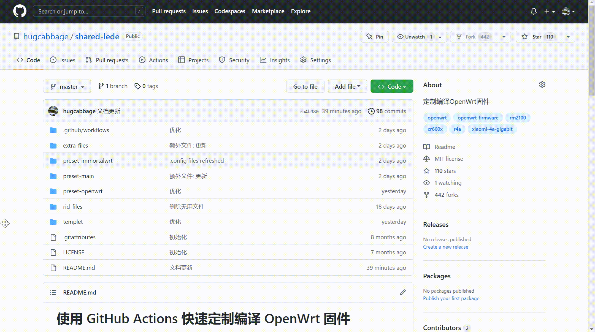
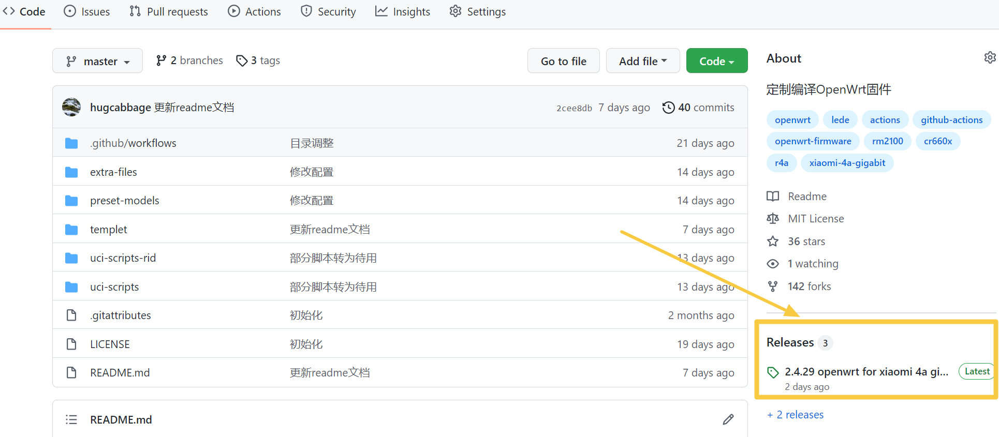
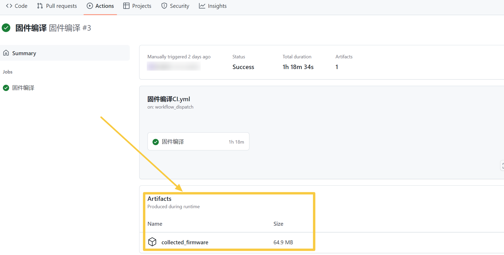

# 使用 GitHub Actions 快速定制编译 OpenWrt 固件

流程文档参考[KFERMercer/OpenWrt-CI](https://github.com/KFERMercer/OpenWrt-CI)，十分感谢！

使用的固件源码包括openwrt官方，以及coolsnowwolf、Lienol、immortalwrt、x-wrt维护的版本，详见[表格](#固件源码)。

预置机型有小米4A千兆版、小米CR6606、红米AX6S等，详见`preset*/headers.json`。

**快速生成固件 ---> 登陆GitHub，fork此仓库，点击上方`Actions`，选择左侧流程中的`build XXX`运行，运行完毕即可下载固件。示意如下：**

</img>

选择机型：在run workflow界面点开`选择设备`的下拉框，即可手动选择机型。

如预置机型中没有你需要的，可使用[templet](templet)目录下的文件新增机型。

## 使用教程

<details>
  
  <summary>点击展开/关闭</summary>

### 1. 注册GitHub账号并开启GitHub Actions

### 2. fork [hugcabbage/shared-lede](https://github.com/hugcabbage/shared-lede)

### 3. 自定义固件

什么也不修改，按默认配置，可以跳过此步。

每个机型关联三个文件，在preset*目录中。

- [数字].clone.sh

此脚本用来拉取固件源码和扩展插件源码，新增插件源时，建议先在本地测试下是否缺依赖。

常用的克隆命令如下（克隆理解为下载即可）：

`git clone 链接`

`git clone -b 分支名 链接`

- [数字].modify.sh

此脚本用于固件初始化设置，修改登录IP、主机名、WiFi名称等。

此脚本用到最多的命令是sed，详细用法参见[链接](https://www.runoob.com/linux/linux-comm-sed.html)，这里只简单说明。

比如，下面这条命令就是用来修改管理IP的：

`sed -i 's/192.168.1.1/192.168.31.1/g' package/base-files/files/bin/config_generate`

`192.168.1.1`是源码中默认的lan口登录IP，也即初始的；`192.168.31.1`是新的，用来替换初始文本的。

可以看出命令的构成是这样的：

`sed -i 's/原字符串/新字符串/g' 文件路径`

这就可以用来替换掉源码中的特定位置，-i指直接改动文件，s指替换，g指全局。

原字符串记为str1，新字符串记为str2，自定义设置改动str2位置即可，如果你改动了str1，那么命令在源码中就匹配不到东西了，替换也就无效了。

>🎈🎈🎈 各基础命令的用法可参考该[链接](https://github.com/danshui-git/shuoming/blob/master/ming.md)，适合新手查阅。

- [数字].config

该文件对应本地编译执行make menuconfig后生成的.config文件。

该文件主要包含luci应用，流程中会自动转为完整的.config。

增减插件修改这个文件即可，以argon主题为例，格式如下：

 `CONFIG_PACKAGE_luci-theme-argon=y`   选中编译进固件的是这种

 `CONFIG_PACKAGE_luci-theme-argon=m`   选中仅编译ipk插件是这种

 `# CONFIG_PACKAGE_luci-theme-argon is not set`  未选中是这种

### 4. Actions中手动开始编译流程

选择你需要的`build XXX`workflow，再点击`Run workflow`，按需填内容，运行即可。

各选项说明如下:

- 超频到1100Mhz:

仅`build lede`有此选项。

默认不勾选。仅适用于5.10内核，除红米AX6S外，其余机型默认皆为5.10内核。

- 使用5.15内核:

仅`build lede`有此选项。

默认不勾选。lean lede源码勾选此项时，编译小米4A千兆版和小米3Gv2时会报错，勿用。

红米AX6S只有5.15内核，不必勾选。

- 选择机型:

点开下拉框，可以选择不同的机型。

- 上传到release:

默认勾选。单文件不能超过2GB，可添加内容记录。 release区见下图：

</img>

- 上传到artifact:

默认不勾选。artifact区见下图：

</img>

- 版本描述:

可作一些简单记录，会在release中显示。

### 5. 编译完成

Actions流程顺利完成后，去release(或者artifact)下载你的固件，release中allfiles.zip是所有文件的打包。

</details>

## preset*目录说明

<details>
  
  <summary>点击展开/关闭</summary>

全部机型信息可查看文件`preset*/headers.json`，各配置目录略有不同，如[preset-openwrt/headers.json](preset-openwrt/headers.json)。

### config说明
- 1.config用于小闪存设备（16MB及以下）
- 2.config用于大闪存设备

### 标号规则
- headers.json中每个机型的数字标号，用于选择对应的clone.sh、modify.sh、config。
- 按headers.json中的机型标号，找不到对应的clone.sh、modify.sh、config时，默认选择1.clone.sh、1.modify.sh、1.config。

### 自定义配置
#### 方法一
修改clone.sh、modify.sh、config三个文件

#### 方法二
- 添加新的clone.sh、modify.sh、config，并用数字标号，比如5.clone.sh、5.modify.sh、5.config
- 修改headers.json指定机型的标号，比如把`"xiaomi-ac2100": ["1", "ramips", "mt7621", "xiaomi_mi-router-ac2100"]`改成`"xiaomi-ac2100": ["5", "ramips", "mt7621", "xiaomi_mi-router-ac2100"]`

#### 方法三
- 添加新的clone.sh、modify.sh、config，并用数字标号，比如5.clone.sh、5.modify.sh、5.config
- 向headers.json添加新机型，比如添加`"xiaomi-ac2100-xxx": ["5", "ramips", "mt7621", "xiaomi_mi-router-ac2100"]`
- 向`.github/workflows/build-xxx.yml`inputs.model.options添加新机型，比如向.github/workflows/build-openwrt.yml添加`- 'xiaomi-ac2100-xxx'`

</details>

## 本地测试

<details>
  
  <summary>点击展开/关闭</summary>

### 本地测试生成.config文件

> 以生成preset-openwrt/other.config为例，编译流程`build openwrt`中`other`机型对应当前的other.config。

1. 使用Codespace或本地环境，克隆本仓库，并进入仓库根目录。

   建议使用Codespace，只需要一个浏览器即可，且不会存在网络问题。

1. 安装yq工具。

   Codespace中安装yq，命令如下：

    ```shell
   wget https://github.com/mikefarah/yq/releases/latest/download/yq_linux_amd64 -O ~/.local/bin/yq
   chmod +x ~/.local/bin/yq
    ```

   本地Linux环境可使用snap安装，命令如下：

    ```shell
   snap install yq
    ```

1. 运行以下命令，克隆openwrt源码。

    ```shell
    chmod +x extra-files/clone.sh
    ./extra-files/clone.sh extra-files/clone.toml openwrt
    cd _test_code
    ```

   clone.sh脚本可以不加参数运行，但需根据提示输入clone.toml路径、源码名、测试文件存放目录（可选）。

1. （可选）从已有的.config修改。

     ```shell
     cp ../preset-openwrt/other.config .config
     ```

1. 运行以下命令，开始配置。

    ```shell
    make menuconfig
    ```

1. 配置完成后，_test_code目录里，也就是现在所在的目录下已生成.config文件。

1. （可选）简化一下.config文件，只保留常用的配置项，运行以下命令。

   ```shell
   chmod +x ../extra-files/ptext
   ../extra-files/ptext c2m .config ../preset-openwrt/other.config
   ```

1. 若执行了上一步的简化则该步跳过。将.config文件复制到本仓库的preset-openwrt目录下，运行以下命令。

   ```shell
   cp .config ../preset-openwrt/other.config
   ```

1. 提交到远程仓库，开始运行编译流程`build openwrt`，选择机型`other`。

</details>

## 固件源码

<details>
  
  <summary>点击展开/关闭</summary>

|配置目录|流程名|源码|
|:----:|:----:|:----:|
|preset-lede|build lede|[coolsnowwolf/lede](https://github.com/coolsnowwolf/lede)|
|preset-lienol-openwrt|build lienol openwrt|[Lienol/openwrt](https://github.com/Lienol/openwrt)|
|preset-openwrt|build openwrt|[openwrt/openwrt](https://github.com/openwrt/openwrt)|
|preset-immortalwrt|build immortalwrt|[immortalwrt/immortalwrt](https://github.com/immortalwrt/immortalwrt)|
|preset-x-wrt|build x-wrt|[x-wrt/x-wrt](https://github.com/x-wrt/x-wrt)|

</details>

## 提示

1. 直接在Actions中运行`build XXX`就能编译出固件，但默认插件数量较少，对插件有增、减需要的，可修改`preset*/[数字].config`。若在`[数字].clone.sh`中添加了插件源，在`[数字].config`要作对应修改，建议先在本地make menuconfig测试。

1. 超频方案默认不启用，方案来自该[帖子](https://www.right.com.cn/forum/thread-4042045-1-1.html)。

1. 小米4A千兆版和小米3Gv2需修改分区才能在breed直刷，参考该[帖子](https://www.right.com.cn/forum/thread-4052254-1-1.html)，本项目中已修改好，见脚本[modify-xiaomi-router-4a-3g-v2.sh](extra-files/modify-xiaomi-router-4a-3g-v2.sh)。

1. 小米4A千兆版和小米3Gv2闪存小(仅16MB)，若编译插件太多，包体积超出闪存上限，则不会生成sysupgrade.bin。

---

### Modify default IP
```
sed -i 's/192.168.1.1/192.168.2.1/g' package/base-files/files/bin/config_generate
```


### Modify default theme
```
sed -i "s/luci-theme-bootstrap/luci-theme-argon/g" feeds/luci/collections/luci/Makefile
```

### Modify hostname
```
sed -i '/uci commit system/i\uci set system.@system[0].hostname='OpenWrt'' package/lean/default-settings/files/zzz-default-settings
```
### 加入编译者信息
```
sed -i "s/OpenWrt /smith build $(TZ=UTC-8 date "+%Y.%m.%d") @ OpenWrt /g" package/lean/default-settings/files/zzz-default-settings
```

### 总结

**源码 -- 机型 -- 版本 -- 插件/主题 -- 配置（IP/密码/Hostname/编译者）**